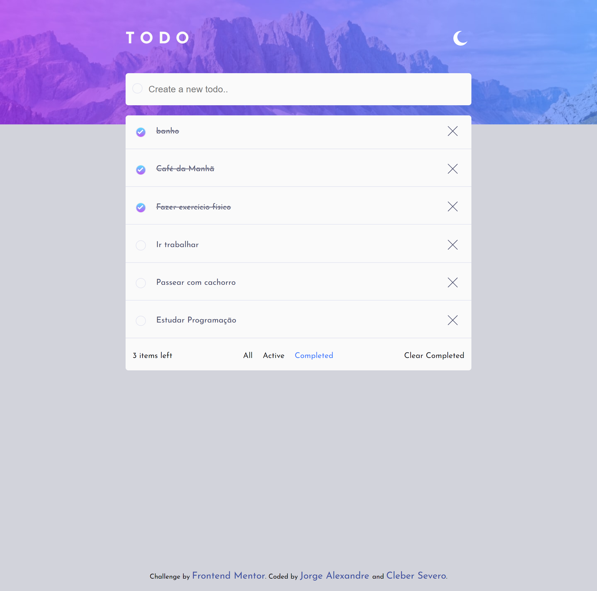
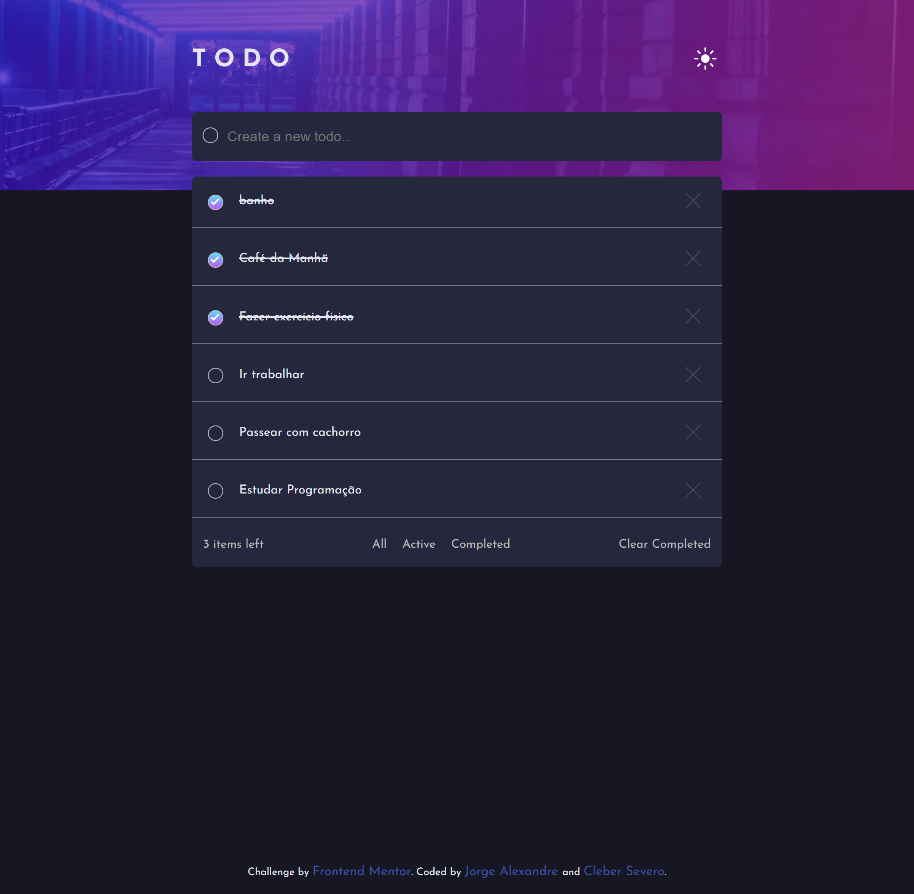
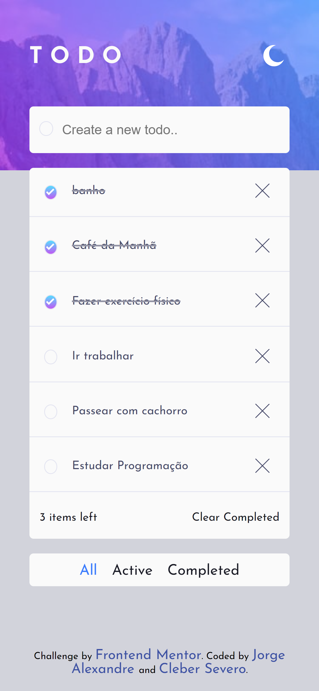
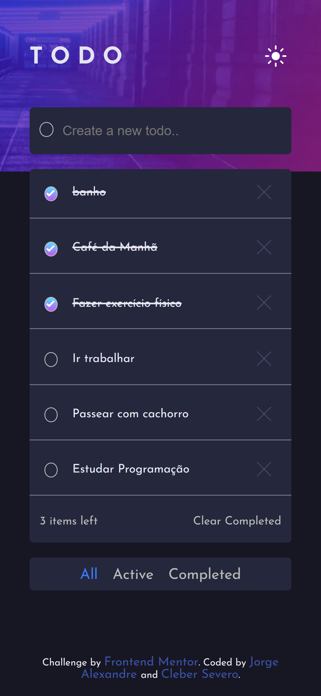

# ToDo List

## Proposta
Olá, obrigado pro vir dar uma conferida no nosso projeto, ele foi feito com uma parceria de dois desenvolvedores *Cléber Severo* e *jorge Alexandre* tendo como base o desafio do <a src="https://www.frontendmentor.io/ ">frontend mentor</a>  

  

## O projeto

Status do projeto: Concluido  

## Como funciona ?
O site é uma aplicação de uma lista de tarefas(to-do list) onde o usuário pode inserir tarefas em uma lista, excluir, organizar e marcar como completas os itens já feitos. Existe a opção de filtrar o que aparece na tela(itens completos ou ativos) e tem um botão que limpa todos os itens já completos. 

As tecnologias utilizadas foram HTML, CSS e JavaScript. 
## Project design

**Lista Desktop** 
 
 
 **Dark mode** 
 
 
 **Mobile** 
 
   
 **Mobile Dark-mode** 

   